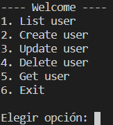
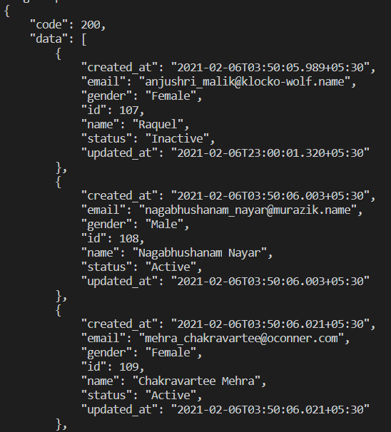
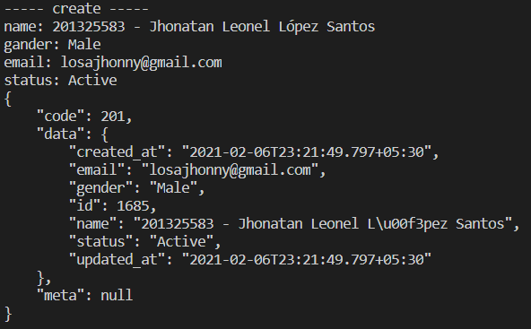
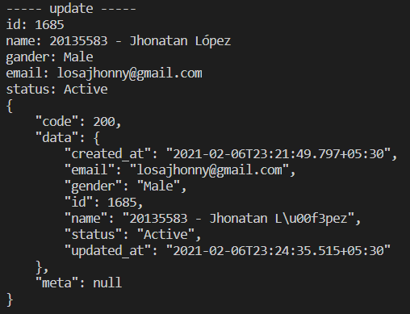
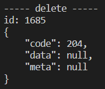
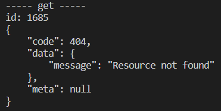

# Práctica 1

## Descrición

Esta práctica consiste en desarrollar un cliente de webservices que se comunique con  [Gorest](https://gorest.co.in/). [Gorest](https://gorest.co.in/) es una api que tiene varios recursos para testeo y prototipos entre los recursos que tiene son las siguientes:

```plaintext
https://gorest.co.in/public-api/users
https://gorest.co.in/public-api/posts
https://gorest.co.in/public-api/comments
https://gorest.co.in/public-api/todos
https://gorest.co.in/public-api/categories
https://gorest.co.in/public-api/products
https://gorest.co.in/public-api/product-categories
```

En esta ocasión se utilizó el recuro de [Usuarios](https://gorest.co.in/public-api/users) para listar, crear, actualizar y eliminar varios usuarios con sus respectivos metodos get, post, patch y delete. Para realizar estas peticiones es necesario registrarse y generar un token de autorización para poder trabajar. Además de incluir el parametro **Authorization** en los headers de las peticiones.

```http
Authorization: Bearer ACCESS-TOKEN
```

Aqui se muestran algunos ejemplos:

```plaintext
1. List users
    curl -i -H "Accept:application/json" -H "Content-Type:application/json" -XGET "https://gorest.co.in/public-api/users"
2. Create user
    curl -i -H "Accept:application/json" -H "Content-Type:application/json" -H "Authorization: Bearer ACCESS-TOKEN" -XPOST "https://gorest.co.in/public-api/users" -d '{"name":"Tenali Ramakrishna", "gender":"Male", "email":"tenali.ramakrishna@15ce.com", "status":"Active"}'
3. Update user
    curl -i -H "Accept:application/json" -H "Content-Type:application/json" -H "Authorization: Bearer ACCESS-TOKEN" -XPATCH "https://gorest.co.in/public-api/users/123" -d '{"name":"Allasani Peddana", "email":"allasani.peddana@15ce.com", "status":"Active"}'
4. Delete user
    curl -i -H "Accept:application/json" -H "Content-Type:application/json" -H "Authorization: Bearer ACCESS-TOKEN" -XDELETE "https://gorest.co.in/public-api/users/123"
```

            
## Contenido

El cliente fue desarrollada en el lenguaje de programación Python con versión 3.8, se desarrollo una pequeña consola en donde el usuario elige cualquiera de las opciones que se presenta.

### Pasos de ejecución

Se debe de acceder a la carpeta de practica1 y luego se procede a iniciar el cliente con los siguientes comandos.

```plaintext
cd Practica1
Python app.py
```

Después de iniciar la app se mostrará un pequeño menu en donde puede listar usuarios, crear usuario, actualizar usuario, eliminar usuario y obtener un usuario en especifico y ademas de poder salir del menu.



La opción 1. Muestra todos los usuarios registrados.



La opción 2. Crea un usuario con los paramateros name, gander, email y status. Devuelve un objeto de respuesta.



La opción 3. Actualiza todos los campos del usuario con los mismos parametros. Devuelve un objeto de respuesta.



La opción 4. Elimina un usuario dando como parametro su identificador. Devuelve un objeto de respuesta.



La opcion 5. Devuelve los datos de un usuario registrado dando como parametro su identificador.



Y la opcion 6 es para salir del menu dando por finalizado el cliente.

### Estandares utilizados

1. Variables en minusculas
2. Constantes en mayusculas
3. Metodos en minusculas