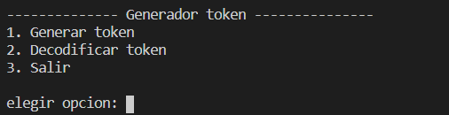
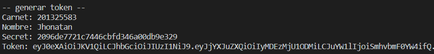

# Práctica 2 - Parte 1

## Descripción
Esta práctica parte 1 consisten en realizar un pequeño programa aplicando seguridad en donde se genera tokens y secrets para un usuario con carnet y nombre. Estos datos son payload para la generacion de tokens jwt, ademas se genera un secret por cada carnet ingresado de 32 caracteres.

```
{
    "carnet": "eje-201325583",
    "nombre": "eje-Jhonatan"
}
```

## Contenido

El cliente fue desarrollada en el lenguaje de programación Python con versión 3.8, se desarrollo una pequeña consola en donde el usuario elige una opción del menu.

# Ejecución

Antes de usar la aplicación se debe de instalar el paquete jwt. Para el secret se utiliza el paquete uuid que trae por defecto python.

```
    pip install pyjwt
```

Despues debe de iniciar la app con el siguiente comando.

```
    Python app.py
```

Despues de iniciar la aplicacion se muestra un menu en donde puede elegir si desea generar un token o decodificar un token, ademas de tener la opcion de salir.



Opcion 1. Esta opcion le pide al usuario su carnet y nombre, con esosdatos se genera un token.



Opcion 2. Esta opcion muestra una lista de tokens generados para comprobar que sea valido, tomando los datos en memoria y seleccionando que token se quiere comprobar. Si es el mismo retorna como respuesta ***TOKEN VALIDO***

