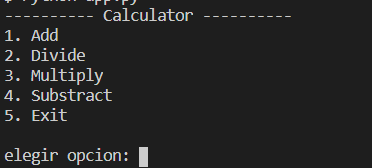
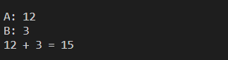

# Práctica 2 - Parte 2

## Descripción
Esta práctica parte 2 consisten en realizar un pequeño programa que consuma el servicio soap de una [Calculadora](http://www.dneonline.com/calculator.asmx), aqui se puede sumar, dividir, multiplicar y restar pasando como parametros numeros enteros.

```
A: entero
B: entero
Respuesta = A OP B
```

## Contenido

El cliente fue desarrollada en el lenguaje de programación Python con versión 3.8, se desarrollo una pequeña consola en donde el usuario elige una opción del menu.

# Ejecución

Antes de usar la aplicación se debe de instalar el paquete jwt. Para el secret se utiliza el paquete uuid que trae por defecto python.

```
    pip install BeautifulSoup
```

Despues debe de iniciar la app con el siguiente comando.

```
    Python app.py
```

Despues de iniciar la aplicacion se muestra un menu en donde puede elegir si desea sumar, dividir, multiplicar o restar ademas de tener la opcion de salir.



Opcion 1. Esta opcion le pide al usuario los dos parametros de entrada A y B, con esos datos se genera una respuesta de una suma.



Opcion 2. Esta opcion le pide al usuario los dos parametros de entrada A y B, con esos datos se genera una respuesta de una division.


Las opciones 3 y 4 trabajan de la misma forma lo unico que varia es el operador para realizar el calculo.