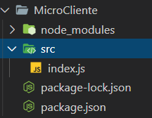

# Practica 3

Esta practica consiste en desarrollar tres microservicios que son **Cliente**, **Restaurante** y **Repartidor** cada uno con tres funciones. Cada microservicio fue desarrollada con ***Node js*** y para crear un servidor con la ayuda de ***Express js***.

Para correr por primera vez los servicios es necesario acceder a sus carpetas 
y luego instalar sus dependencias. Despues de eso ya se puede ejecutar el comando para iniciar el servidor. Despues si se desea volver a ejecutar el servidor ya no va hacer necesario instalar las dependencias porque estas se realizan una sola vez, en dado caso hay nuevas versiones se vuelve instalar otra vez las dependencias debido a que pueden existir otras dependencias.

```
cd <Nombre Micro Servicio>
npm install
npm start
```

La ubicacion del codigo fuente de cada servidor es directamente desde su carpeta accediendo a la carpeta src en donde se encuentra el archivo index.js.

**Ejemplo ubicacion**



## Cliente

Este microservicio inicia en ***http://localhost:3001***

<table>
<thead>
	<tr>
		<th>Nombre</th>
		<th>Descripcion</th>
		<th>Endpoint</th>
		<th>Respuesta</th>
	</tr>
</thead>
<tbody>
	<tr>
		<td>Solicitar pedido al restaurante</td>
		<td>Este endpoint registra un pedido mandando como parametro el identificador de un restaurante, identificador del menu, direccion en donde se debe enviar la comida y un numero de telefono para tener comunicacion al  momento de la entrega.</td>
		<td>
		    <p>/client/request-order/:idrest/:idmenu/:dir/:phone</p>
		    <p>Ejemplo:</p>
		    <p>/client/request-order/1/2/zona1/78965412</p>
		</td>
		<td>
		    Devuelve un json con este formato { message: 'order sent!', data: pedido }
		</td>
	</tr>
	<tr>
		<td>Verificar estado del pedido al restaurante</td>
		<td>Este endpoint verifica el estado del pedido mandando como parametro el identificador. </td>
		<td>
		    <p>/client/state-restaurant/:idpedido</p>
		    <p>Ejemplo:</p>
		    <p>/client/state-restaurant/0</p>
		</td>
		<td>
		    Devuelve un json con este formato { data: pedido, state: state } en donde state puede tomar los valores de 'wait', 'cook' y 'finish' que indica si esta en el pedido en espera, si el pedido esta en la cocina o si ya termino con su pedido.
		</td>
	</tr>
	<tr>
		<td>Verificar estado del pedido al repartidor</td>
		<td>Este endpoint verifica el estado del pedido mandando como parametro el identificador. </td>
		<td>
		    <p>/client/state-delivery/:idpedido</p>
		    <p>Ejemplo:</p>
		    <p>/client/state-delivery/0</p>
		</td>
		<td>
		    Devuelve un json con este formato { data: pedido, state: state } en donde state puede tomar los valores de 'wait', 'on the way to ...' y 'delivered' que indica si el pedido esta en espera, si el pedido ya esta en camino o si ya entrego su pedido.
		</td>
	</tr>
</tbody>
</table>

## Restaurante
Este microservicio inicia en ***http://localhost:3002***

<table>
<thead>
	<tr>
		<th>Nombre</th>
		<th>Descripcion</th>
		<th>Endpoint</th>
		<th>Respuesta</th>
	</tr>
</thead>
<tbody>
	<tr>
		<td>Recibir pedido del cliente</td>
		<td>Este endpoint registra un pedido mandando como parametro el identificador de un restaurante, identificador del menu, direccion en donde se debe enviar la comida y un numero de telefono para tener comunicacion al  momento de la entrega.</td>
		<td>
		    <p>/restaurant/receive-order/:idrest/:idmenu/:dir/:phone</p>
		    <p>Ejemplo:</p>
		    <p>/restaurant/receive-order/1/2/zona1/78965412</p>
		</td>
		<td>
		    Devuelve un json con este formato { message: 'order received!', data: pedido }
		</td>
	</tr>
	<tr>
		<td>Informar estado del pedido al cliente</td>
		<td>Este endpoint informa el estado del pedido mandando como parametro el identificador. </td>
		<td>
		    <p>/restaurant/state-order/0</p>
		    <p>Ejemplo:</p>
		    <p>/restaurant/state-order/0</p>
		</td>
		<td>
		    Devuelve un json con este formato { data: pedido, state: state } en donde state puede tomar los valores de 'wait', 'cook' y 'finish' que indica si esta en el pedido en espera, si el pedido esta en la cocina o si ya termino con su pedido.
		</td>
	</tr>
	<tr>
		<td>Avisar al repartidor que ya esta listo el pedido</td>
		<td>Este endpoint le manda el pedido al repartidor avisando que ya esta listo para la entrega. </td>
		<td>
		    <p>/restaurant/report-delivery-man/0</p>
		    <p>Ejemplo:</p>
		    <p>/restaurant/report-delivery-man/0</p>
		</td>
		<td>
		    Devuelve un json con este formato { data: pedido, state: state } en donde state puede tomar el valor de 'ready to deliver' que indica al repartidor si el pedido ya esta listo para entregar.
		</td>
	</tr>
</tbody>
</table>

## Repartidor
Este microservicio inicia en ***http://localhost:3003***

<table>
<thead>
	<tr>
		<th>Nombre</th>
		<th>Descripcion</th>
		<th>Endpoint</th>
		<th>Respuesta</th>
	</tr>
</thead>
<tbody>
	<tr>
		<td>Recibir pedido del restaurante</td>
		<td>Este endpoint registra un pedido mandando como parametro el identificador de un restaurante, identificador del menu, direccion en donde se debe enviar la comida y un numero de telefono para tener comunicacion al  momento de la entrega.</td>
		<td>
		    <p>/delivery-man/receive-order/:idrest/:idmenu/:dir/:phone</p>
		    <p>Ejemplo:</p>
		    <p>/delivery-man/receive-order/1/2/zona1/78965412</p>
		</td>
		<td>
		    Devuelve un json con este formato { message: 'order received!', data: pedido }
		</td>
	</tr>
	<tr>
		<td>Informar estado del pedido al cliente</td>
		<td>Este endpoint informa el estado del pedido mandando como parametro el identificador. </td>
		<td>
		    <p>/delivery-man/state-order/:idpedido</p>
		    <p>Ejemplo:</p>
		    <p>/delivery-man/state-order/0</p>
		</td>
		<td>
		    Devuelve un json con este formato { data: pedido, state: state } en donde state puede tomar los valores de 'wait', 'on the way to ...' y 'delivered' que indica si el pedido esta en espera, si el pedido ya esta en camino o si ya entrego su pedido.
		</td>
	</tr>
	<tr>
		<td>Marcar como entregado</td>
		<td>Este endpoint notifica que ya fue entregado. </td>
		<td>
		    <p>/delivery-man/report-delivery/:idpedido</p>
		    <p>Ejemplo:</p>
		    <p>/delivery-man/report-delivery/0</p>
		</td>
		<td>
		    Devuelve un json con este formato { data: pedido, state: state } en donde state puede tomar el valor de 'delivered' que indica que el pedido ha sido entregado.
		</td>
	</tr>
</tbody>
</table>


Cada microservicio se le coloco un endpoint para mostrar todos los pedidos que tienen

*   /client/order/list
*   /restaurant/order/list
*   /delivery-man/order/list

### Link del video - Presentacion de funcionalidades

[https://youtu.be/70FTGzyApl8](PruebasFuncionalidad)