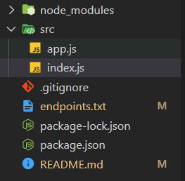

# Practica 4

Esta practica consiste en construir un ESB, ESB es una implementacion de un orquestador de servicios y nos ayuda a tener comunicacion entre los microservicios.

Para implentar el ESB fue necesario tener un registro de servicios que son parte del sistema, en este caso se trabajó con los microservicios de la practica anterior que son el servicio de cliente, restaurante y repartidor.

Cada servicio se modificó agregando una función en donde especifica toda la información necesaria para la comunicación, esta función se comunica con el ESB para realizar su registro.

A continuación se presenta un formato para el registro de servicios.

```json
{
    "name": "client",
    "host": "host",
    "port": "3001",
    "endpoints": [
        {
            "method": "GET",
            "endpoint": "/order-list",
            "parameters": [ "id" ]
        }
        ...
    ]
}
```

## ESB

Antes de probar nuestra app, se debe volver a ejecutar el comando ***npm install***, esto para actualizar las dependencias que se este utilizando, hacerlo en cada microservicio. Este servicio inicia en ***http://localhost:3000***.

La ubicación del ESB es la siguiente. Dirigirse en la carpeta practica4 y ahi encuentra lo que esta en la imagen, el archivo index.js se encuentra el codigo de la implementación.



````
Proceso antes de iniciar un servicio
npm install
npm start
````

La información de cada microservicio se envia al servicio de ESB utilizando el endpoint de registro. El servicio de ESB es el que de iniciar primero despues se procede de iniciar los siguientes servicios y asi poder registrar todos los demas microservicios.

````plaintext
/api/esb/add-service
````

Para validar que el servicio se ha registrado correctamente, puede hacer uso del siguiente endpoint.

````plaintext
/api/esb/list-service
````

Ahora con las modificaciones que se hicieron se debe acceder a todos los endpoints de los microservicios de la siguiente manera:

````plaintext
ESB - http://localhost:3000

client - http://localhost:3001
/api/esb/client/order-list
/api/esb/client/request-order/:idrest/:idmenu/:dir/:phone
/api/esb/client/state-restaurant/:idpedido
/api/esb/client/state-delivery/:idpedido

restaurant - http://localhost:3002
/api/esb/restaurant/order-list
/api/esb/restaurant/receive-order/:idrest/:idmenu/:dir/:phone
/api/esb/restaurant/state-order/:idpedido
/api/esb/restaurant/report-delivery-man/:idpedido

delivery-man - http://localhost:3003
/api/esb/delivery-man/order-list
/api/esb/delivery-man/receive-order/:idrest/:idmenu/:dir/:phone
/api/esb/delivery-man/state-order/:idpedido
/api/esb/delivery-man/report-delivery/:idpedido
````

## Link - Demostración de funcionalidad

https://youtu.be/SYnrNuBCrwA

