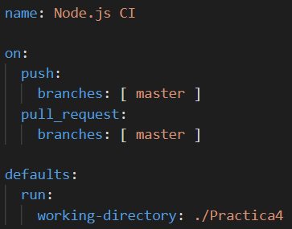
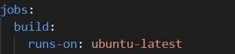
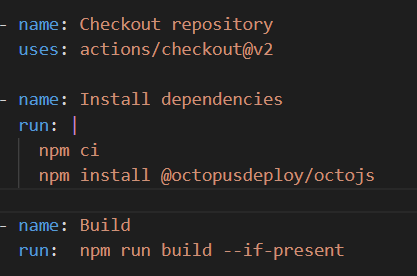
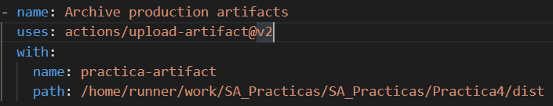
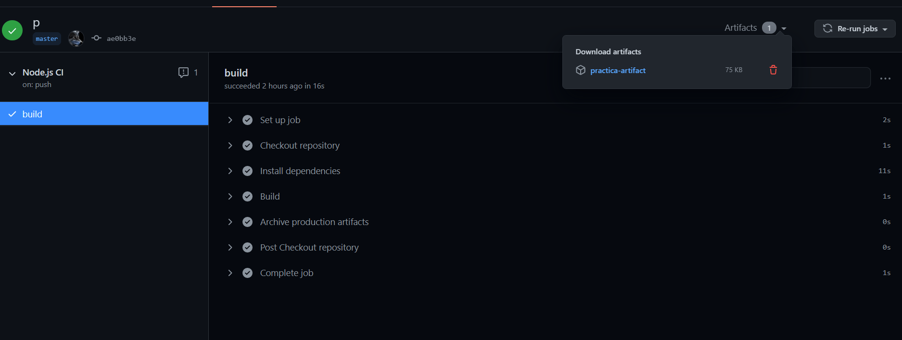
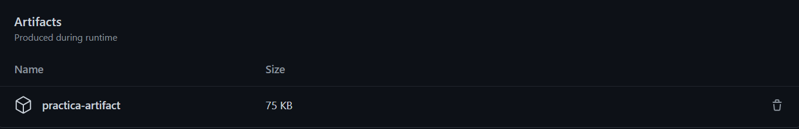

# Practica 5

Consiste en los siguientes procesos:

*   Versionamiento SEMVER
*   Creacion de ramas master y develop
*   Herramienta para construccion
*   Enviar repositorio con las nuevas ramas, tags, herramienta de construcción y pruebas de la construcción.

## Herramienta de construccion

Se instalo ***octojs*** para empaquetar el servidor EBS en un archivo comprimido. Se puede instalar agregando la opcion -g o no, esta opcion es para instalar la dependencia de manera global. Para subir el artefacto se hizo sin la opcion -g

````
npm install -g @octopusdeploy/octojs
ó
npm install @octopusdeploy/octojs
````

Y tambien se utilizo lo que es Actions de Github para hacer el proceso de construccion. Para trabajar con actions se utiliza los archivos .yml.

En este archivo se debe de especificar el nombre del actions con la opcion **name**. Despues con la opcion **on** se establece cuando se va a ejecutar este actions, en este caso se hara al momento de realizar push en la rama **master**.

Antes de seguir se establece el directorio donde tenemos nuestra aplicacion y poder hacer el proceso de construccion.



Despues se crea un job, es una tarea a ejecutar, se debe de espicificar en donde vamos a ejecutar las instrucciones.



ahora se crea los pasos (steps). antes se debe de teclear lo siguiente ***steps:***, despues se debe de describir los pasos a realizar, para este proceso se realizo la instalacion de actions/checkout@v2, luego se realiza la limpieza e instalacion de dependencias, despues se instala el paquete octopus para el proceso de construccion, por ultimo, se corre el comando de construccion.



El comando de construccion contiene lo siguiente

````
octojs pack -O ./dist
````
Este comando empaqueta todo el servidor y lo coloca en una carpeta dist.

Despues se realiza el proceso de subir el artefacto.



## Pruebas de construccion del artefacto





## Versionamiento

Para el versionamiento se inicia desde la version 0.1.0 dado que se esta iniciando con este tema, a pesar de haber ya introducido codigo.