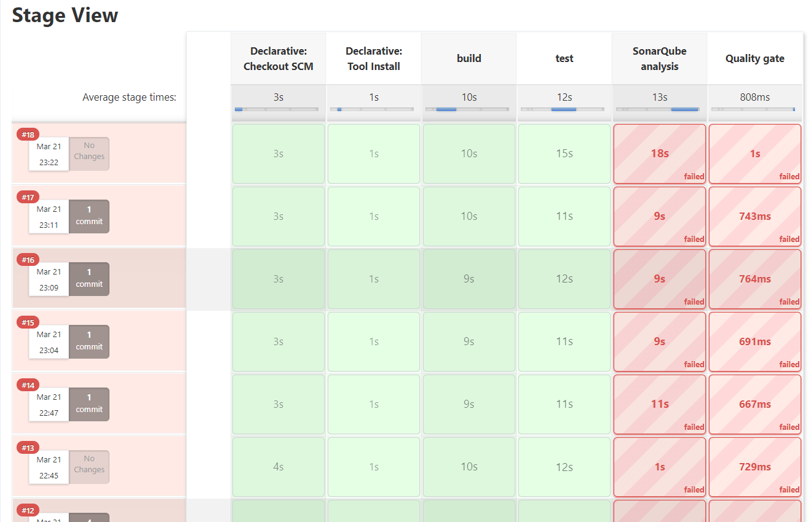

# Practica 7

* Hacer un despliegue
* Prueba unitaria (o de sistema)
* Revisión de estándares de código
* Revisión de calidad de código (análisis)
* Construcción de artefactos
* Entrega de los artefactos en un repositorio
* El último commit debe estar atado a un log GitLab o Jenkins
donde se muestre el éxito de todos los anteriores.
* Incluir en el readme el acceso al repositorio de artefactos, donde pueda descargarse el último.

Esta practica solamente corre los test

