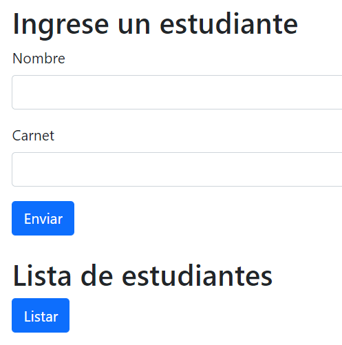
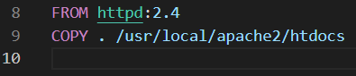
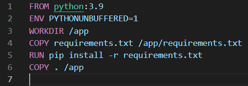

# Practica 8
 La practica trata en hacer uso de docker para montar un servidor con conexion a una base de datos, para este ejemplo se utiliza una base de datos que tiene una tabla estudiante en donde solo se pide el nombre y carnet.
 
 
 
 La lista de estudiantes lo muestra en la consola, mientras que los mensajes como una alerta.
 
## Ubicacion de archivos

- Dockerfile: [Backend](Dockerfile)
- Dockerfile: [Frontend](cliente/Dockerfile)
- Dockercompose: [Docker-compose](docker-compose.yml)
- Index: [Index](cliente/index.html)
 
## Dockerfile del backend

 
## Dockerfile del frontend


## Docker-compose
````yml
version: '3.8'
services:
  frontend:
    build: ./cliente
    container_name: frontend-p8
    volumes:
      - ./cliente:/usr/local/apache2/htdocs
    ports:
      - 80:80
    depends_on:
      - backend

  backend:
    build:
      context: .
      dockerfile: Dockerfile
    container_name: backend-p8
    command: 'python project/manage.py runserver 0.0.0.0:8000'
    ports:
      - 8000:8000
    volumes:
      - .:/app
    depends_on:
      - db
  
  db:
    image: mysql:5.7.22
    restart: always
    environment:
      MYSQL_DATABASE: admin
      MYSQL_USER: root
      MYSQL_PASSWORD: root
      MYSQL_ROOT_PASSWORD: root
    volumes:
      - .dbdata:/var/lib/mysql
    ports:
      - 33066:3306

````

## Levantar los servicios
 ````
 docker-compose up
 ````